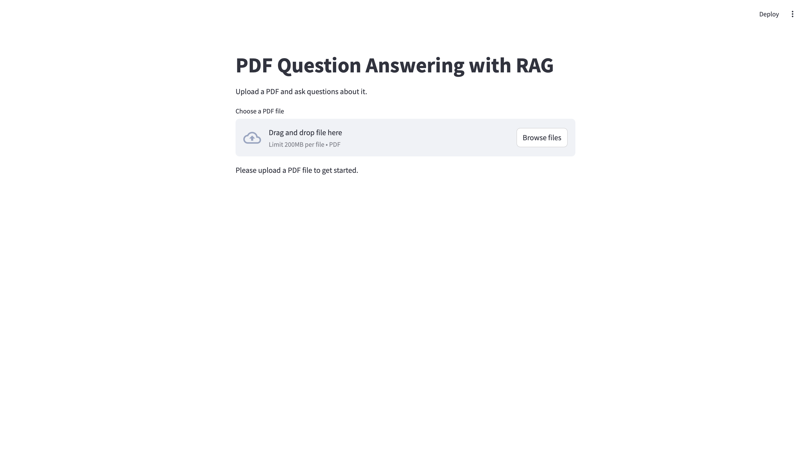
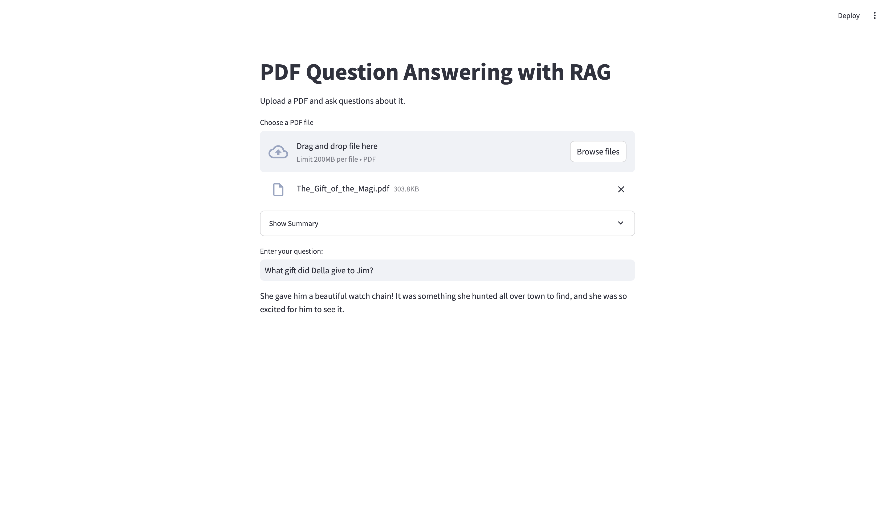
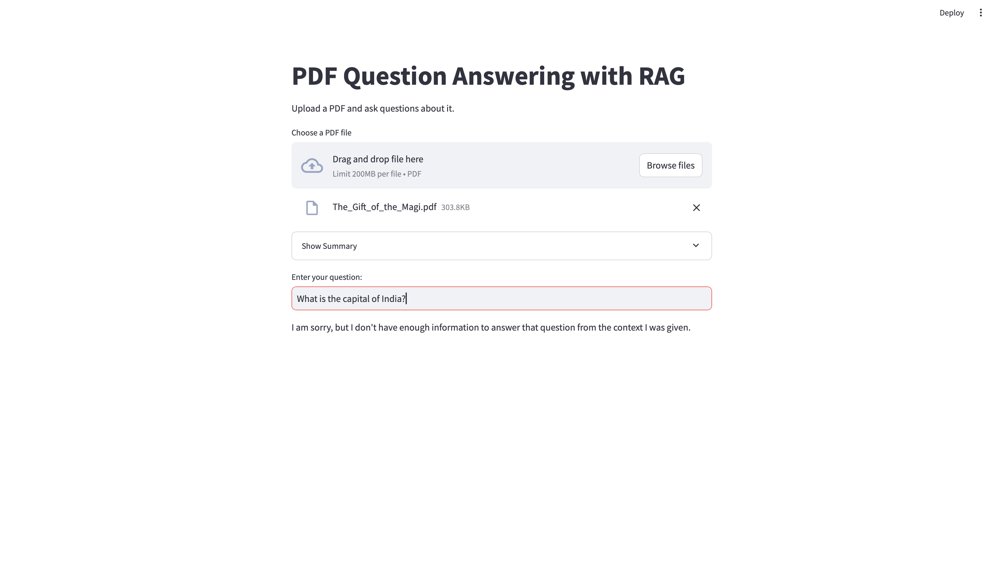

# PDF Question Answering with RAG (Retrieval-Augmented Generation)

This project implements a Retrieval-Augmented Generation (RAG) system that allows users to upload PDF documents and ask questions about their content.  It uses Streamlit for the web interface, Google Gemini for OCR and text generation, and ChromaDB for vector storage.

## Features

*   **PDF Upload:** Users can upload their own PDF files.
*   **OCR:** Extracts text from PDFs using Google Gemini's vision capabilities (handles scanned documents).
*   **Summarization:** Generates a concise summary of the uploaded document.
*   **Question Answering:** Answers questions based on the PDF content using a RAG approach.
*   **Vector Database:** Uses ChromaDB for efficient similarity search and retrieval of relevant text chunks.
*   **Web Interface:** Provides a simple, interactive web interface with Streamlit.

## Dependencies

*   PyMuPDF (fitz)
*   google-generativeai
*   sentence-transformers
*   chromadb
*   streamlit
*   python-dotenv
*   Pillow (PIL)
*   numpy

These can be installed using: `pip install -r requirements.txt`

## Setup

1.  **Clone the repository:**

    ```bash
    git clone https://github.com/vishisht245/PDF-RAG-Chatbot.git
    cd PDF-RAG-Chatbot
    ```

2.  **Create a virtual environment (recommended):**

    It's highly recommended to use a virtual environment to manage your project's dependencies. This isolates your project's dependencies from other Python projects and your system-wide Python installation.

    *   **Using `venv` (built-in, Python 3.3+):**

        ```bash
        python3 -m venv .venv
        ```

        This creates a virtual environment named `.venv` in your project's root directory.

    *   **Activating the virtual environment:**

        *   **On Linux/macOS:**
            ```bash
            source .venv/bin/activate
            ```

        *   **On Windows (Command Prompt):**
            ```bash
            .venv\Scripts\activate
            ```

        *   **On Windows (PowerShell):**
            ```bash
            .venv\Scripts\Activate.ps1
            ```

        After activating, you should see `(.venv)` (or your environment's name) at the beginning of your terminal prompt.

3.  **Install Dependencies:**
    ```bash
    pip install -r requirements.txt
    ```
4.  **Obtain a Google Gemini API Key:**
    *   Go to [Google AI Studio](https://ai.google.dev/).
    *   Create a new project (or use an existing one).
    *   Create an API Key.

5.  **Set the API Key:**
    *   Create a `.env` file in the project's root directory:
        ```
        GOOGLE_API_KEY="your-api-key-here"
        ```
        Replace `"your-api-key-here"` with your actual API key.

## Running the Application
1.  Make sure you are in your virtual environment (activate it if necessary).
2.  Run the Streamlit app:
    ```bash
    streamlit run app.py
    ```
3.  A new tab will open in your web browser with the application.  Upload a PDF and start asking questions!


## Design Choices

*   **OCR:** Gemini's `gemini-1.5-flash` model is used with image input (via PIL) for accurate text extraction, even from scanned PDFs.
*   **Chunking:** A sliding window approach is used, with a `chunk_size` of 500 characters and an `overlap` of 50 characters.
*   **Vector Database:** ChromaDB is used in-memory for storing and retrieving text chunks.
*   **LLM:**  Gemini (`gemini-1.5-flash`) is used consistently for OCR, summarization, and answer generation.
*   **Caching:** Streamlit's `@st.cache_resource` and `@st.cache_data` are used extensively to improve performance:
    *   The OCR processing (which is slow) is cached based on the *content* of the uploaded file.  This prevents unnecessary re-processing if the same file is uploaded again.
    *   The `RAGService` is cached based on a unique hash of the file content. This ensures that a new `RAGService` (and a new ChromaDB collection) is created for each *different* file, while still benefiting from caching for the same file.
## Usage

1.  **Upload a PDF:** Use the "Choose a PDF file" button.

    

2.  **Ask a Question:** Enter your question in the text box.

    **(Example using "The_Gift_of_the_Magi.pdf")**

    **Example 1 (In-Context):**

    

    **Question:** What gift did Della give to Jim?

    **Example 2 (Out-of-Context):**

    

    **Question:** What is the capital of India?

## Error Handling
Basic Error Handling is implemented.

## RAG Implementation

1.  **PDF Upload and OCR:** The user uploads a PDF.  The `preprocessing.py` module uses `fitz` (PyMuPDF) and Gemini to extract the text, page by page.
2.  **Text Chunking:** The extracted text is split into smaller, overlapping chunks using a sliding window.
3.  **Embedding Generation:**  The `sentence-transformers` library (`all-MiniLM-L6-v2` model) creates embeddings for each text chunk.
4.  **Vector Storage:** The chunks and their embeddings are stored in a ChromaDB collection.
5.  **Question Processing:** When the user asks a question:
    *   The question is converted into an embedding.
    *   ChromaDB is queried to find the most relevant chunks (based on embedding similarity).
    *   The relevant chunks are combined to form a context.
    *   The question and context are sent to Gemini, which generates the answer.
